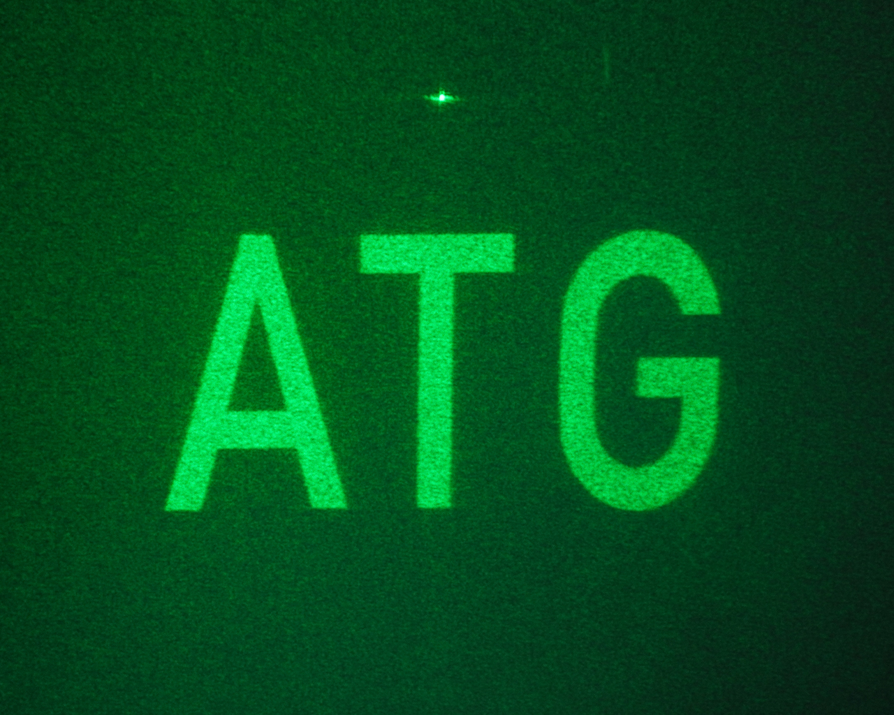

# Holography Project
**Adam Goldney  
4th Year Engineering Project
Jesus College Cambridge**

https://github.com/adamgoldney/Holography-Project

Software built in python to produce One Step Phase Retrieval Holograms for use on the Freeman Holographic Projector. Builds on work of previous students in the CMMPE group.

Hologram                     |  Replay Field
:-------------------------:|:-------------------------:
  |  

The hologram makes use of 3 RGB channels and 8 bit levels on the porjector driver, multiplexing 24 total OSPR frames.
